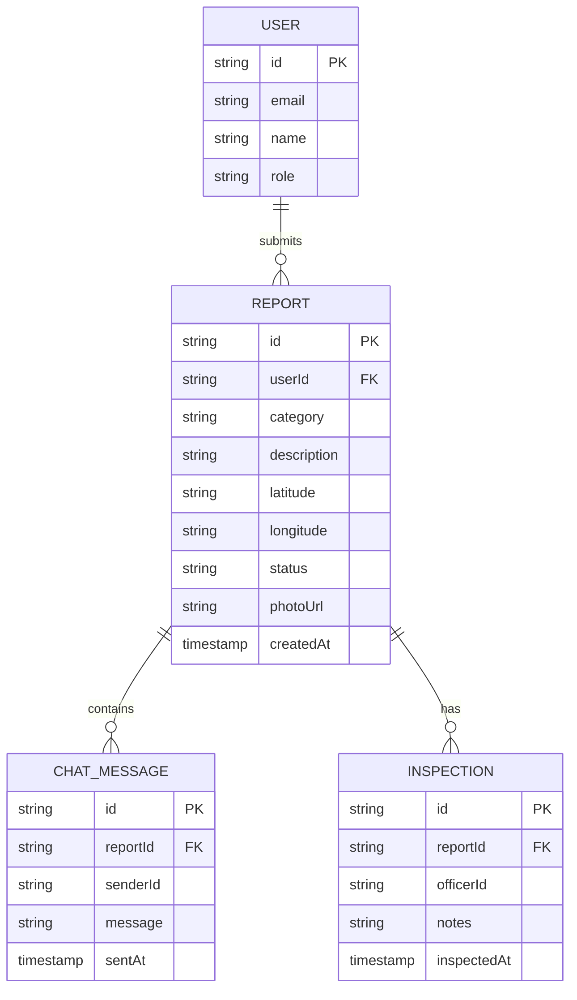

# Entity Relationship (ER) Diagram - CEGCT

```mermaid
erDiagram
    USER ||--o{ REPORT : submits
    USER {
        string id PK
        string email
        string name
        string role
    }
    REPORT ||--o{ CHAT_MESSAGE : contains
    REPORT ||--o{ INSPECTION : has
    REPORT {
        string id PK
        string userId FK
        string category
        string description
        string latitude
        string longitude
        string status
        string photoUrl
        timestamp createdAt
    }
    CHAT_MESSAGE {
        string id PK
        string reportId FK
        string senderId
        string message
        timestamp sentAt
    }
    INSPECTION {
        string id PK
        string reportId FK
        string officerId
        string notes
        timestamp inspectedAt
    }
```
